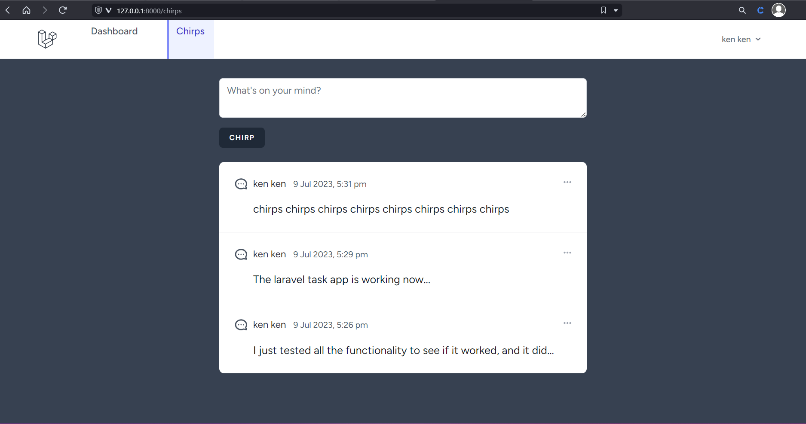

## Laravel Microblogging App
Built a microblogging web app with Laravel with feature tests.


### Pre-requisites
- Basic understanding of PHP.
- Basic understanding of laravel.

## Getting Started
Clone the repository and run the app using:
```
php artisan server
```

## Screenshot


## Learning Laravel

Laravel has the most extensive and thorough [documentation](https://laravel.com/docs) and video tutorial library of all modern web application frameworks, making it a breeze to get started with the framework.

You may also try the [Laravel Bootcamp](https://bootcamp.laravel.com), where you will be guided through building a modern Laravel application from scratch.

If you don't feel like reading, [Laracasts](https://laracasts.com) can help. Laracasts contains over 2000 video tutorials on a range of topics including Laravel, modern PHP, unit testing, and JavaScript. Boost your skills by digging into our comprehensive video library.